# BGG Hidden Gems — End-to-End Research Pipeline (through Phase 6)

> **INTERMEDIATE / NOT FINAL RESEARCH OUTPUTS** — This document is a technical pipeline map through Phase 6. It traces how raw BGG data becomes the active analytical population and how each phase's output feeds the next. It does **not** present a hidden-gem ranking and does **not** validate broad appeal.

**Active analytical population (primary for all downstream work):** `16,627` research-population games × users with `≥10` ratings in-universe minus `degenerate_strict` (667 users) → **24,509,788** observations, **288,730** users, **16,564** games with ≥1 active rating (`data/processed/phase2-active/`). Historical/reference artefacts under `data/processed/phase2/` remain untouched for provenance — do not mix with active parameters.

```mermaid
flowchart TD
    %% --- Source ---
    RAW["<b>Raw sources</b><br/>data/raw/bgg_games_current.parquet (161,404 rows, 34 cols)<br/>data/raw/bgg.sqlite → 26.9M rating_observations"]:::source

    %% --- Population cleaning ---
    POP["<b>Population cleaning</b><br/><i>Purpose: define publishable, rated, comparable games</i><br/>scripts/01_clean_population.py<br/>→ bgg_research_population.parquet<br/><b>16,627 games</b> (non-expansion, 1950-2026, ≥100 users_rated, Latin title, ¬structural PnP)"]:::active

    RAW --> POP

    %% --- Historical reference branch ---
    subgraph HISTORICAL["Historical / Reference Branch — do NOT use for current estimation"]
        direction TB
        FILT["Filtered extracts<br/>scripts/13 + scripts/23 threshold study<br/>data/processed/phase2-filtered/<br/>25,335,220 obs (94.10% of full)<br/>544,955 users, 16,567 games"]:::historical
        FULL["Full snapshot<br/>data/processed/phase2/<br/>26,924,709 obs, 95,540 games<br/>scripts/15–22 fits: severity, decomposition,<br/>audiences, baselines"]:::historical
        FILT --- FULL
    end

    POP --> FILT

    %% --- Active branch ---
    ACTIVE["<b>Active extracts (PRIMARY)</b><br/><i>Purpose: restrict to informative raters on same 16,627 games</i><br/>scripts/24_build_active_phase2_extracts.py<br/>t=10 on cnt_filtered + scripts/25 degenerate_strict filter<br/>→ data/processed/phase2-active/<br/><b>24,509,788 obs</b> (96.74% of filtered, 91.03% of full)<br/><b>288,730 users</b> (52.98% of filtered), <b>16,564 games</b>"]:::active

    POP --> ACTIVE

    %% --- Phase 2 refresh ---
    P2R["<b>Phase 2 — Baseline refresh (ACTIVE)</b><br/><i>Purpose: re-estimate global rater severity on the active universe</i><br/>scripts/26_phase2_active_baseline_refresh.py (ALS)<br/>→ user_severity_active.parquet / game_adjusted_means_active.parquet<br/><b>μ = 7.144</b>, σₑ = 1.194, σ_α = 0.864<br/>parity r = 0.877 (min10), R² game 0.201 / rater 0.218 / both 0.394<br/>gap 10-24 vs 1000+ +1.255 raw → -0.03 severity-adjusted"]:::active

    ACTIVE --> P2R

    P3["<b>Phase 3 — Taste audit</b><br/><i>Purpose: test common user×type taste beyond global severity</i><br/>scripts/27_phase3_taste_active.py<br/>15 frequent types (weight tertiles, top cats/mechs)<br/>→ phase3_taste_active.json<br/>|τ| ≤ 0.036 vs rating SD 1.53; parity r~0.18-0.36 vs 0.877<br/>held-out R² +0.004 — <b>no material taste; do NOT add user×type</b>"]:::active

    P2R --> P3

    P31["<b>Phase 3.1 — Informativeness</b><br/><i>Purpose: does experience predict more discriminating ratings after severity?</i><br/>scripts/28_phase31_rater_informativeness.py<br/>→ phase31_informativeness.json<br/>scale SD flat 1.15-1.16, ordering r flat 0.44-0.50,<br/>pairwise RMSE heavier not tighter, LOO RMSE flat 1.19-1.21<br/><b>no gradient; do NOT weight by experience</b>"]:::active

    P3 --> P31

    P4["<b>Phase 4 — Within-game selection audit</b><br/><i>Purpose: are this game's raters unusually enthusiastic beyond delta?</i><br/>scripts/29_phase4_within_game_selection.py<br/>→ phase4_selection.json + selection_diagnostic.csv (16,564 games)<br/>mean(delta)_pool SD 0.177; selection_residual ~0 (SD 7e-15)<br/>cross-half SD 0.015; raw vs adj top100 overlap 62/100<br/><b>no material game-specific residual; keep adj_mean</b>"]:::active

    P31 --> P4

    P5["<b>Phase 5 — Quality estimator</b><br/><i>Purpose: most defensible per-game quality y for RQ2</i><br/>scripts/30_phase5_quality_estimator.py<br/>→ phase5_quality_comparison.json<br/>compare raw / bayes (5.49, λ~2500) / <b>adj_mean = AVG(rating - delta)</b> / EB shrunk (λ=1.91)<br/>held-out adj→adj RMSE 0.217 (R² .938) vs raw→adj 0.410 vs bayes 1.338<br/>SE = 1.194/√n (median 0.070, P10 0.119, P90 0.023)<br/><b>primary y = adj_mean (μ=7.144); shrunk as sensitivity only</b>"]:::active

    P4 --> P5

    P6["<b>Phase 6 — Expected quality & underratedness (CURRENT)</b><br/><i>Purpose: E[adj_mean | characteristics] + operational residual</i><br/>scripts/31_phase6_expected_quality_underratedness.py<br/>estimation sample <b>16,549 games</b> (15 dropped: weight/playtime null)<br/>spec ladder CV R²: Q0 .196 → flex-year .295 → +weight .540 → +cats .570 → <b>Q3b band-volume .582</b><br/>→ phase6_comparative.json + phase6_volume_diagnostic.json<br/><b>Preferred: Q3b/OLS</b> (46 feats: 8 vol bands + spline year + weight + structure + 28 cats)<br/>CV R² .582 ± .023, RMSE .563, corr(resid,log n) -.004, band-flat<br/>WLS_n degrades CV (.582→.560) — <b>OLS retained</b><br/>volume slope +0.261/10× adj (vs +0.230 raw); classification (c) unchanged/grows<br/>→ phase6_residuals_active.parquet:<br/><b>underratedness_g = adj_mean - E[adj_mean|X] (Q3b/OLS)</b>"]:::activeCurrent

    P5 --> P6

    NEXT["<b>NOT IN SCOPE HERE</b><br/>Phase 7 hidden-gem / broad-appeal screen<br/>requires exposure denominator & external validation<br/>— no score built in Phase 6"]:::next

    P6 --> NEXT

    %% Legend styling
    classDef source fill:#fff,stroke:#333,stroke-width:1.5px
    classDef active fill:#e3f2fd,stroke:#1565c0,stroke-width:1.5px
    classDef historical fill:#f5f5f5,stroke:#9e9e9e,stroke-width:1.2px,stroke-dasharray: 6 4
    classDef activeCurrent fill:#bbdefb,stroke:#0d47a1,stroke-width:2px
    classDef next fill:#fff3e0,stroke:#ef6c00,stroke-width:1.5px,stroke-dasharray: 6 4
```

> **How to read:** solid blue = **current active pipeline** (`data/processed/phase2-active/`); dashed grey = **historical / reference** (`data/processed/phase2/` full-snapshot and `data/processed/phase2-filtered/`). Each box states **purpose** (italic) and **principal output passed downstream** (bold). The pipeline is linear after the active-extract fork — Phase 2 refresh artefacts (`mu`, `user_severity_active`, `game_adjusted_means_active`) are reused without refit in Phases 3–6.

### Phase table — purpose and handoff

| Step | Purpose (what question it answers) | Principal output passed to next phase |
|---|---|---|
| **Raw sources** | Immutable scrape: which games and ratings exist? | `bgg_games_current.parquet` (161,404) + `bgg.sqlite` (26.9M `rating_observations`) |
| **Population cleaning** `scripts/01` | Define the 16,627-game research population worth studying (removes expansions, unpublished, <100-rated, non-Latin, structural PnP/self-pub) | `bgg_research_population.parquet` — **16,627 games** (16,567 with ratings in SQLite) |
| **Historical: filtered extracts** `scripts/13, 23` | Reference universe for 16,627 games × all users; threshold study (t=10 primary, t=20 sensitivity) | `data/processed/phase2-filtered/` — 25,335,220 obs, 544,955 users (historical) |
| **Historical: full snapshot** `scripts/15–22` | Initial user-level severity, decomposition, audience, friend-rating comparison — sealed as reference | `data/processed/phase2/` — 26,924,709 obs, 95,540 games; `rater_stats`, `user_severity`, `game_adjusted_means` (historical) |
| **Active extracts (PRIMARY)** `scripts/24 + 25` | Restrict to informative raters on the same 16,627 games; remove low-information degenerate raters | `data/processed/phase2-active/` — **24,509,788 obs**, **288,730 users**, **16,564 games** (`rating_observations_active.parquet`, `users_active.parquet`) |
| **Phase 2 refresh** `scripts/26` | Re-estimate global additive rater severity on the active universe (the only severity that replicates) | `user_severity_active.parquet`, `game_adjusted_means_active.parquet` — **μ = 7.144**, σₑ = 1.194, σ_α = 0.864; committed `active_baseline_refresh.json` |
| **Phase 3 taste** `scripts/27` | Is there stable, material `user × game-type` taste beyond global severity? | `phase3_taste_active.json` — \|τ\| ≤ 0.036, held-out R² +0.004 → **no user×type model** |
| **Phase 3.1 informativeness** `scripts/28` | Does lifetime experience predict more discriminating / consensual ratings after severity? | `phase31_informativeness.json` — scale, ordering, agreement, LOO all flat → **no experience weighting beyond delta** |
| **Phase 4 selection audit** `scripts/29` | Are the raters who chose *this* game unusually enthusiastic for it beyond their global harshness? | `phase4_selection.json` + `selection_diagnostic.csv` (16,564 games) — `mean(delta)_pool` SD 0.177 drives raw→adj shift (top100 62/100), residual ~0 → **keep adj_mean, no residual ranking** |
| **Phase 5 quality** `scripts/30` | Which per-game quality estimand is most defensible for RQ2 under varying n? | `phase5_quality_comparison.json` — **adj_mean = AVG(rating − delta)** primary (held-out RMSE 0.217); EB λ = 1.91 shrunk as sensitivity; bayes (λ ~2500, prior 5.49) not defensible |
| **Phase 6 underratedness (current)** `scripts/31` | Given popularity/age/complexity/audience, which games rate higher than expected? | `phase6_comparative.json` + `phase6_volume_diagnostic.json` → `phase6_residuals_active.parquet` — **Q3b/OLS** (46 feats, CV R² .582, RMSE .563) ⇒ **underratedness_g = adj_mean − E[adj_mean|X]** (model-dependent screen) |

### Current active population — validated counts

All numbers below are quoted from the committed Phase 6 / active artefacts and agree with `parquet_catalog.csv`, `active_baseline_refresh.json`, `phase6_comparative.json`, `phase6_volume_diagnostic.json`:

- **Population:** 16,627 games (`bgg_research_population.parquet`, `scripts/01`) — 16,567 have ≥1 rating in the SQLite snapshot; **16,564** have ≥1 active rating; **16,549** complete-case for Phase 6 regression (15 dropped for missing weight/playtime).
- **Observations:** full 26,924,709 → filtered 25,335,220 (94.10% of full) → **active 24,509,788** (96.74% of filtered, 91.03% of full).
- **Users:** full 606,497 → filtered 544,955 → **active 288,730** (52.98% of filtered); before `degenerate_strict` removal: 289,397 users / 24,558,361 ratings at t=10; strict removes 667 users / 48,573 obs.
- **Severity baseline (active ALS, scripts/26, reused in Phases 3–6):** **μ = 7.144** (7.1440076757), σₑ = 1.1940701084, σ_α = 0.8638400937; mean `delta` by band `10-24 +0.27 → 1000+ -0.78` (spread 1.04); parity Pearson 0.877 (min10 each half, n=200k); `R²` game 0.201 / rater 0.218 / both 0.394; holdout RMSE game-only 1.472 → with severity 1.238.
- **Volume gradient (Phase 6 diagnostic, scripts/31, n_active primary):** slope per 10× volume +0.230 raw / **+0.261 adj** (partial weight+year: +0.288 raw / +0.323 adj); `users_rated` sensitivity +0.473 raw / +0.515 adj; decile gap raw +0.305 → adj +0.361; classification **(c) broadly unchanged or grows** — severity adjustment does not explain the gradient.
- **Phase 6 preferred spec:** **Q3b_flex_volume / OLS** — 8 volume-band dummies + natural-spline year + weight + structure + 28 category flags (46 features); OLS over WLS_n (WLS_n CV .5822 → .5599, β_log_n +28–48% shift, residual-volume leak −0.08 to −0.13); categories kept, mechanics (+34) as sensitivity (Q3b vs Q4 Spearman .958, top-1% Jaccard .579).

### Underratedness ≠ hidden gem ≠ broad appeal

Per `AGENTS.md` Research Questions and `research_handoff.md` RQ3 status:

- **Underratedness (RQ2, Phase 6):** `underratedness_g = adj_mean_g − E[adj_mean_g | volume, year, weight, playtime, players, reimplementation, categories]` under **Q3b/OLS**. An operational, model-dependent conditional anomaly on the retained BGG population — not latent quality, not causal, not broad appeal. Use with `SE = 1.194/√n` and CV residual for robustness; WLS variants are sensitivity only.
- **Hidden gem (RQ3):** of the underrated games, which show evidence their appeal **extends beyond the niche currently rating them**. Requires a measure of audience reach and cross-audience performance. A high rating from a small, self-selected group is not broad-appeal evidence; sample-size shrinkage alone does not fix selection.
- **Broad appeal (unidentified in this data):** would require exposure denominator (`who saw but did not rate`), plays/sales, or external audience outcomes — none present. `users_rated` measures participation in the selected BGG rating population, not breadth.

Phase 6 explicitly **does not build a hidden-gem score and does not start Phase 7**. The friend-provided `debiased_rating` and BGG `bayes_rating` remain baselines/hypotheses, not ground truth.

---

### Provenance

**Source scripts (rerunnable, bounded `4GB/threads3`, copy-once `scratch/phase2-active`):**
`scripts/01_clean_population.py` → `scripts/24_build_active_phase2_extracts.py` (plus `scripts/23_user_threshold_study.py`, `scripts/25_phase2_anomalous_rater_audit.py`) → `scripts/26_phase2_active_baseline_refresh.py` → `scripts/27_phase3_taste_active.py` → `scripts/28_phase31_rater_informativeness.py` → `scripts/29_phase4_within_game_selection.py` → `scripts/30_phase5_quality_estimator.py` → `scripts/31_phase6_expected_quality_underratedness.py`.

**Key input artefacts (committed / gitignored):**
`scratch/phase2/bgg_research_population.parquet` (16,627) • `data/processed/phase2-active/rating_observations_active.parquet` (24,509,788) • `data/processed/phase2-active/users_active.parquet` (288,730) • `data/processed/phase2-active/user_severity_active.parquet` + `game_adjusted_means_active.parquet` (μ = 7.144) • `docs/phase2-active/active_baseline_refresh.json` + `active_baseline_validation.json` + `parquet_catalog.csv` + `phase3_taste_active.json` + `phase31_informativeness.json` + `phase4_selection.json` + `phase5_quality_comparison.json` + **`phase6_comparative.json`** + **`phase6_volume_diagnostic.json`** + gitignored `phase6_residuals_active.parquet` + `reports/phase6_underratedness/` (comparative_table, volume_diagnostic, residual diagnostics).

**Active population for this pipeline:** `16,627 × ≥10, ¬strict` → **24.5M obs** (`24,509,788`), **288,730 users**, **16,564 games**. Severity prior **μ = 7.144** (σₑ = 1.194, σ_α = 0.864). **Current expected-quality spec: Q3b/OLS** (Q3b_flex_volume, OLS, 46 feats, CV R² .582, RMSE .563) as documented in `docs/phase2-active/phase6_comparative.json` (preferred_specification) — WLS_n and mechanics-augmented Q4 retained as sensitivity only; volume-band controls absorb the convex non-monotonic bottom (sub-100 band) and enforce band-flat residuals by construction.

**Reading order for verification:** `findings.md` headers through Phase 6 (2026-08-24) → `docs/phase2-active/README.md` (active universe + Phases 2–6 refresh/taste/informativeness/selection/quality/underratedness) → `docs/research_handoff.md` (RQs, baselines, what remains unresolved) → Phase 2–6 PR bodies (#5, #6, #8, #9, #10, #11, #12) for purpose/output phrasing → `docs/phase2-active/` JSONs above for numbers.

*Generated for branch `fm/bgg-phase6-w1-pipeline` — intermediate artifact, not a final report. Do not use as a hidden-gem ranking.*
